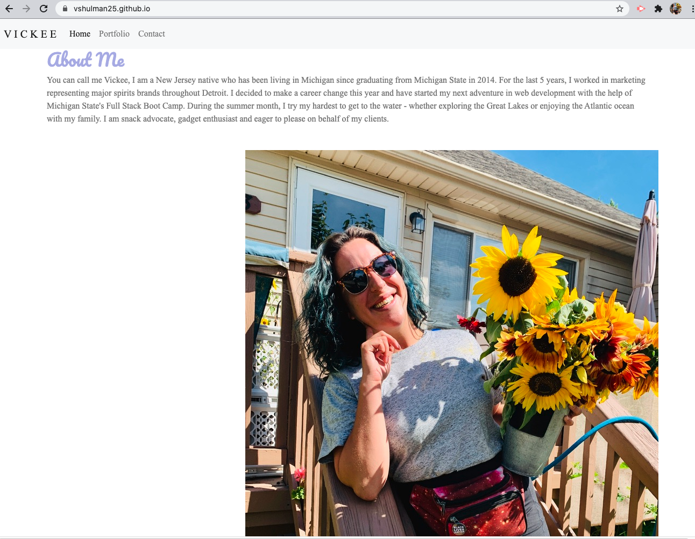
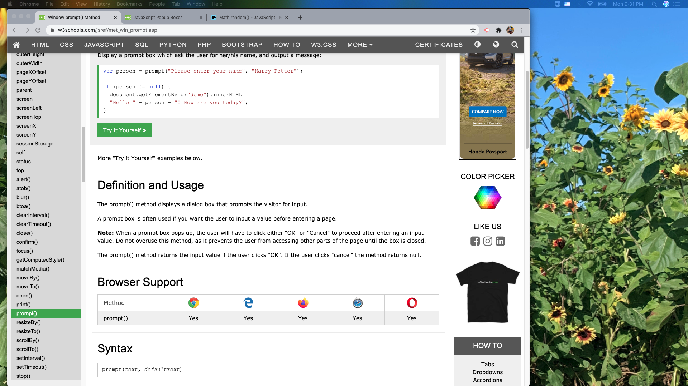
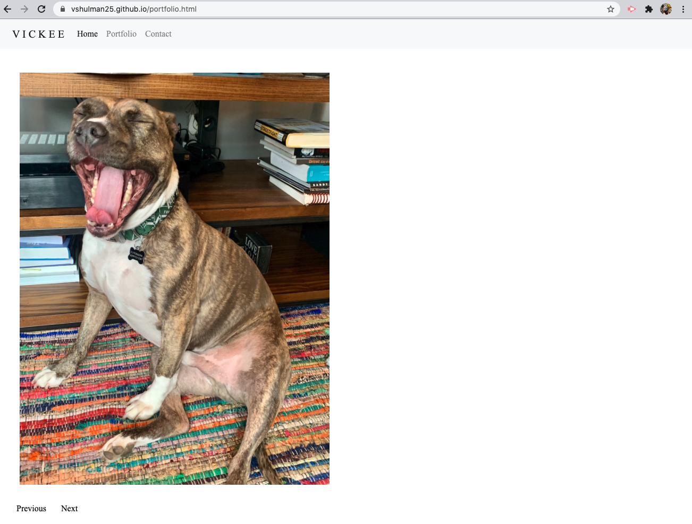

# 1:Responsive Portfolio

For this assignment, I was tasked with building my initial portfolio using HTML, CSS and Bootstrap. This portfolio is the start of my career in web development - I am eager and excited to improve this portfolio in the upcoming months.

---
## Description 

The purpose of this assignment was to build a responsive webpage featuring the with the following files - index.html, portfolio.html, contact.html - styled with a CSS style sheet and with working bootstrap elements. Per the instructions, I included a navigation bar that stays on all pages, with working links and toggles properly depending on screen size. 

In addition to the layout being responsive, all images included respond properly and when reduced to a small enough screen, the navigation bar will collapse into a hamburger style. I have included personal touches throughout the webpage including some facts about myself and a bit of my favorite color. 

---
## Installation

Use preferred code reader and browser to view HTML, CSS & README files.

---
## Preview 

 
 

---

## Live Link

(https://vshulman25.github.io/)

---
## Credits

Developer - Victoria Shulman 

---
