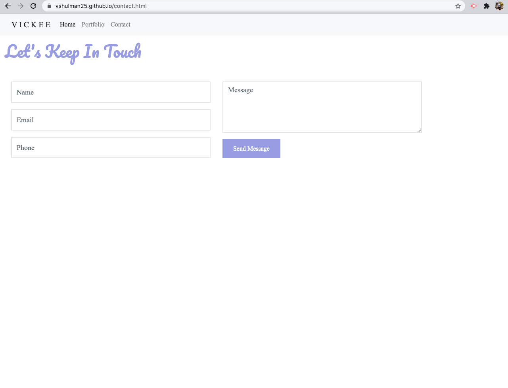

# 1:Responsive Portfolio

For this assignment, I was tasked with building my initial portfolio using HTML, CSS and Bootstrap. This portfolio is the start of my career in web development - I am eager and excited to improve this portfolio in the upcoming months.

---
## Description 

The purpose of this assignment was to build a responsive webpage with the following files - index.html, portfolio.html, contact.html - styled with CSS in an external sheet linked within each page. My page boasts working Bootstrap elements as well as a navigation bar that stays on all pages and toggles with working links.

In addition to the layout being responsive, all images included respond properly and when reduced to a small enough screen, the navigation bar will collapse to a hamburger style. I have included personal touches throughout the webpage including some facts about myself and a bit of my favorite color. 

---
## Installation

Use preferred code reader and browser to view HTML, CSS & README files.

---
## Preview 

 
 

---

## Live Link

(https://vshulman25.github.io/)

---
## Credits

Developer - Victoria Shulman 

---
